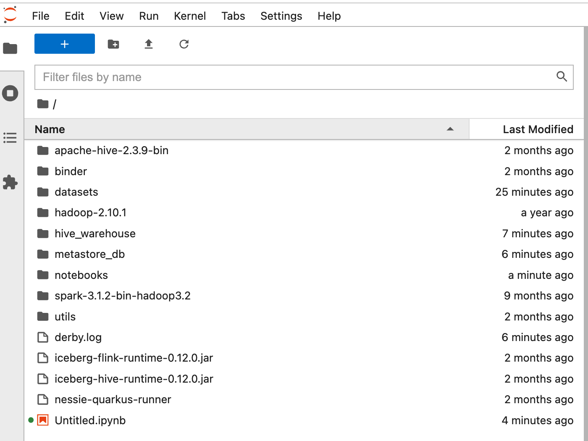

## Building binder locally

### Prerequisites
You need to have a python 3.7+ installed. 
We recommend to use [pyenv](https://github.com/pyenv/pyenv) for managing your python environment(s). 

To build the binder image locally, firstly, you need to install `jupyter-repo2docker` dependency:

```shell
python -m pip install --upgrade pip
pip install jupyter-repo2docker
```

### Building the image
Once you have all dependencies, run:

```shell
jupyter-repo2docker .
```
It will start the local binder instance and expose it via a docker port. 
Make sure to run it in the root directory of this project (not in the `binder` director). 

### Connecting to a container
After those steps, the binder should be running on your local machine.
Next, find the output similar to this:
```shell
[C 13:38:25.199 NotebookApp] 
    
    To access the notebook, open this file in a browser:
        file:///home/jovyan/.local/share/jupyter/runtime/nbserver-40-open.html
    Or copy and paste this URL:
        http://127.0.0.1:53076/?token=c3e06b61997ed8ff70b031a94114214b6954c503ae202844
```
and open the URL in your browser. You should see the following directories:
.

Finally, you can open the `notebooks` folder and start one of the `ipynb` notebooks.